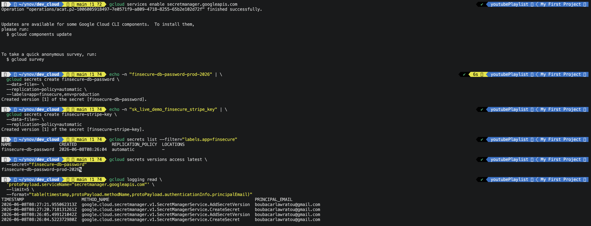
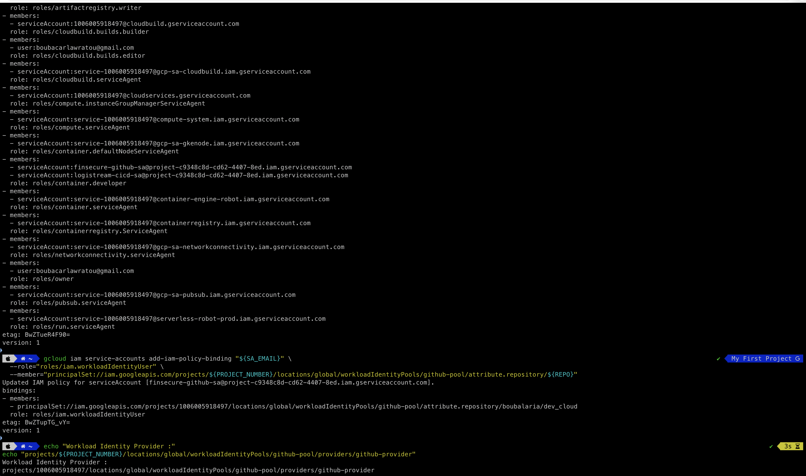
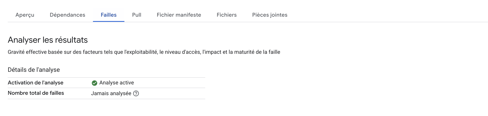
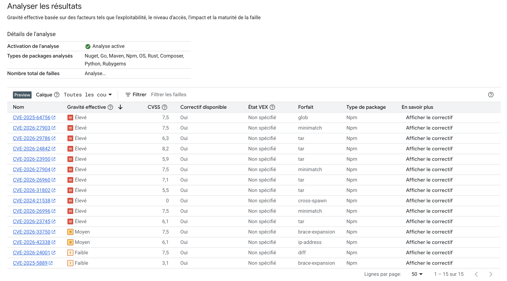
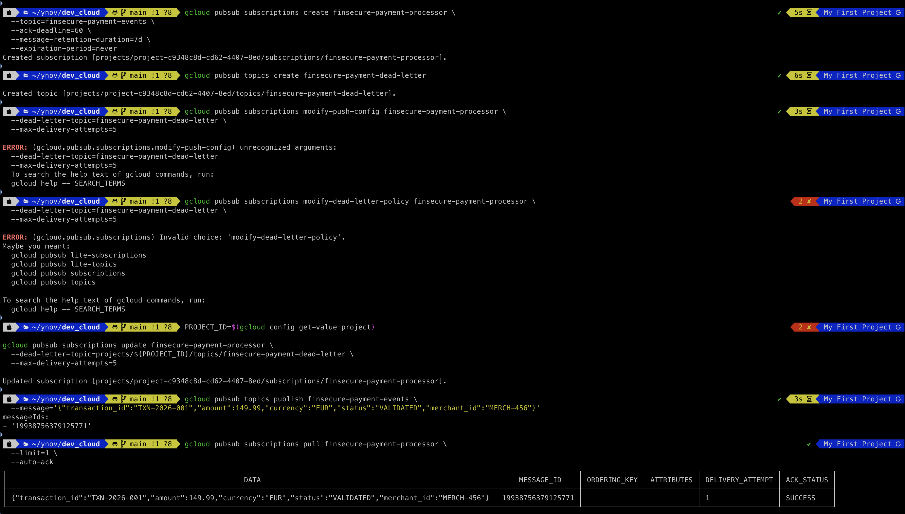
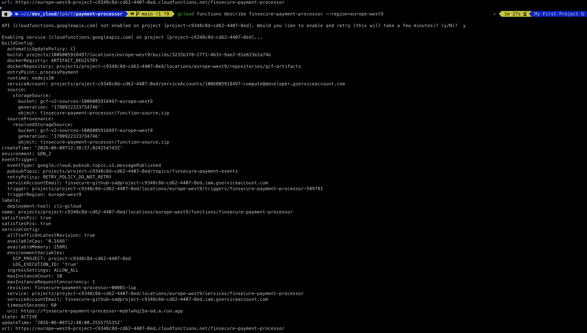
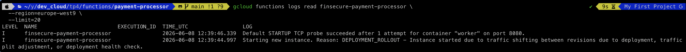
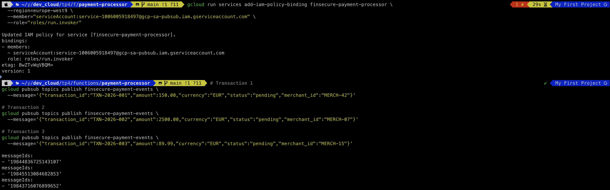
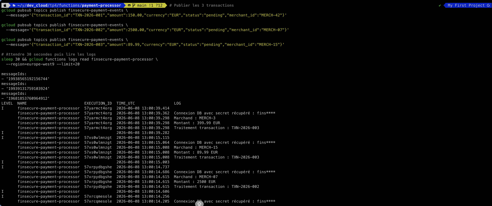
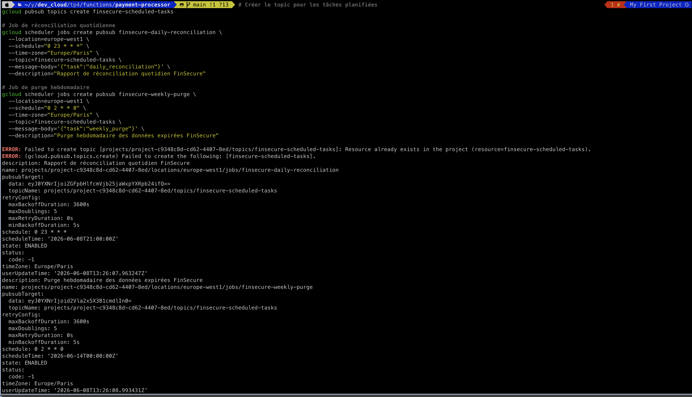

# TP 4 — DevSecOps, Architecture Serverless & FinOps
## Cours 4 | Développer pour le Cloud | YNOV Campus Montpellier — Master 2
**Date :** 18/05/2026 | **Durée TP :** 3h30 | **Plateforme :** Google Cloud Platform

---

> **Contexte entreprise — FinSecure**
>
> FinSecure est une fintech française agréée par l'ACPR qui traite des paiements en ligne pour des e-commerçants. Avec 50 000 transactions/jour et une réglementation DSP2 stricte, la sécurité est non-négociable. Après une levée de fonds Série A, l'équipe technique (8 personnes) doit industrialiser ses pratiques : le pipeline CI/CD actuel déploie des images Docker sans scan de vulnérabilités, les secrets sont stockés en variables d'environnement en dur, et la facture GCP a triplé en 3 mois sans raison identifiée. Vous êtes le/la Lead Cloud Engineer recruté(e) pour remédier à tout ça.

---

> **Prérequis validés (Cours 3) :**
> - Cluster GKE Autopilot opérationnel (`tp3-cluster`)
> - Pipeline GitHub Actions fonctionnel (TP3)
> - Artifact Registry configuré avec des images Docker pushées

**Objectifs de ce TP :**
- Intégrer la sécurité dans le pipeline CI/CD (DevSecOps)
- Gérer les secrets avec GCP Secret Manager et Workload Identity
- Construire une architecture serverless event-driven avec Cloud Functions et Pub/Sub
- Analyser et optimiser les coûts cloud (FinOps)
- Améliorer les performances avec un cache Redis (Cloud Memorystore)

**Livrables attendus :**
- [ ] Pipeline CI/CD enrichi avec scan de vulnérabilités et Secret Manager
- [ ] Cloud Function déployée et déclenchée par Pub/Sub
- [ ] Budget GCP configuré avec alertes email
- [ ] Dashboard de coûts avec labels de ressources
- [ ] Benchmark avant/après cache Redis avec résultats mesurés

---

## Partie 1 — DevSecOps : Sécurité intégrée dans le pipeline CI/CD

> FinSecure vient de recevoir un rapport d'audit signalant que des clés API en dur ont été trouvées dans le dépôt Git (via `git log`). De plus, les images Docker déployées en production n'ont jamais été scannées pour des CVE critiques. Cette partie corrige ces deux problèmes.

### 1.1 — GCP Secret Manager : remplacer les variables en dur

Secret Manager stocke les secrets chiffrés avec Cloud KMS, avec audit complet des accès et rotation automatique.

```bash
# Activer l'API Secret Manager
gcloud services enable secretmanager.googleapis.com

# Créer un secret pour la clé de base de données FinSecure
echo -n "finsecure-db-password-prod-2026" | \
  gcloud secrets create finsecure-db-password \
  --data-file=- \
  --replication-policy=automatic \
  --labels=app=finsecure,env=production

# Créer un secret pour la clé API Stripe
echo -n "sk_live_demo_finsecure_stripe_key" | \
  gcloud secrets create finsecure-stripe-key \
  --data-file=- \
  --replication-policy=automatic

# Lister les secrets créés
gcloud secrets list --filter="labels.app=finsecure"

# Lire la valeur d'un secret (accès audité)
gcloud secrets versions access latest \
  --secret="finsecure-db-password"

# Voir l'historique d'accès dans Cloud Audit Logs
gcloud logging read \
  'protoPayload.serviceName="secretmanager.googleapis.com"' \
  --limit=5 \
  --format="table(timestamp,protoPayload.methodName,protoPayload.authenticationInfo.principalEmail)"
```
![Secrets créés dans Secret Manager et audit log] 

**Question :** En dehors de Secret Manager, citez deux autres solutions GCP pour gérer des configurations sensibles dans Kubernetes, et expliquez quand utiliser chacune.
```
Réponse :
1. Kubernetes Secrets natifs (kubectl) : permettent de stocker des données sensibles directement dans etcd du cluster.
   À utiliser pour des secrets simples à durée de vie longue, sans besoin d'audit fin ni de rotation automatique.
   Limite : les valeurs sont encodées en base64 (pas chiffrées par défaut), donc moins sécurisées que Secret Manager.

2. Config Connector (GCP) / External Secrets Operator : synchronise automatiquement des secrets GCP Secret Manager
   vers des Kubernetes Secrets. À utiliser quand on veut garder l'API Kubernetes standard dans les pods (secretKeyRef)
   tout en bénéficiant du chiffrement et de l'audit de Secret Manager. Idéal pour des équipes qui ne veulent pas
   modifier le code applicatif.
```

---

### 1.2 — Workload Identity : accès sans clé JSON

> Actuellement, le pipeline CI/CD de FinSecure utilise une clé JSON de Service Account stockée dans GitHub Secrets. Si cette clé fuite, n'importe qui peut accéder à GCP. **Workload Identity Federation** permet d'authentifier GitHub Actions auprès de GCP sans aucune clé longue durée.

```bash
PROJECT_ID=$(gcloud config get-value project)
PROJECT_NUMBER=$(gcloud projects describe ${PROJECT_ID} --format='value(projectNumber)')

# Créer un Workload Identity Pool (représente GitHub comme fournisseur d'identité)
gcloud iam workload-identity-pools create "github-pool" \
  --location="global" \
  --display-name="GitHub Actions Pool" \
  --description="Pool pour authentifier GitHub Actions sans clé JSON"

# Créer un Provider OIDC dans le pool (GitHub émet des tokens OIDC par pipeline)
gcloud iam workload-identity-pools providers create-oidc "github-provider" \
  --location="global" \
  --workload-identity-pool="github-pool" \
  --display-name="GitHub OIDC Provider" \
  --attribute-mapping="google.subject=assertion.sub,attribute.repository=assertion.repository,attribute.actor=assertion.actor" \
  --issuer-uri="https://token.actions.githubusercontent.com"

# Créer un Service Account minimal (lecture Artifact Registry + deploy GKE)
gcloud iam service-accounts create finsecure-github-sa \
  --display-name="FinSecure GitHub Actions SA"

SA_EMAIL="finsecure-github-sa@${PROJECT_ID}.iam.gserviceaccount.com"

# Accorder les permissions nécessaires au SA
gcloud projects add-iam-policy-binding ${PROJECT_ID} \
  --member="serviceAccount:${SA_EMAIL}" \
  --role="roles/artifactregistry.writer"

gcloud projects add-iam-policy-binding ${PROJECT_ID} \
  --member="serviceAccount:${SA_EMAIL}" \
  --role="roles/container.developer"

# Lier GitHub au Service Account via le pool
# Remplacer GITHUB_ORG/REPO par votre dépôt
REPO="VOTRE_GITHUB_ORG/ynov-cloud-tp4"

gcloud iam service-accounts add-iam-policy-binding "${SA_EMAIL}" \
  --role="roles/iam.workloadIdentityUser" \
  --member="principalSet://iam.googleapis.com/projects/${PROJECT_NUMBER}/locations/global/workloadIdentityPools/github-pool/attribute.repository/${REPO}"

# Récupérer l'identifiant du pool (à configurer dans GitHub Actions)
echo "Workload Identity Provider :"
echo "projects/${PROJECT_NUMBER}/locations/global/workloadIdentityPools/github-pool/providers/github-provider"
```


Mettez à jour `.github/workflows/deploy.yml` pour utiliser Workload Identity :

```yaml
# Remplacer le bloc d'authentification existant par :
- name: Authentification GCP (Workload Identity - sans clé JSON)
  uses: google-github-actions/auth@v2
  with:
    workload_identity_provider: "projects/${{ secrets.GCP_PROJECT_NUMBER }}/locations/global/workloadIdentityPools/github-pool/providers/github-provider"
    service_account: "finsecure-github-sa@${{ secrets.GCP_PROJECT_ID }}.iam.gserviceaccount.com"
    # Remarque : plus de credentials_json → plus de clé longue durée à gérer
```

**Question :** Pourquoi Workload Identity Federation est-il plus sécurisé qu'une clé JSON de Service Account ? Quel risque élimine-t-il concrètement pour FinSecure ?
```
Réponse :
Workload Identity Federation est plus sécurisé car il n'y a aucune clé longue durée (JSON) à gérer, stocker ou faire
tourner. GitHub Actions reçoit un token OIDC éphémère (valable quelques minutes) émis par GitHub, que GCP vérifie
directement via le protocole OIDC sans jamais échanger de clé secrète.

Risque éliminé pour FinSecure : si une clé JSON fuite (ex : commit accidentel sur GitHub, exfiltration du CI), un
attaquant a un accès illimité et permanent à GCP jusqu'à révocation manuelle. Avec WIF, le token est inutilisable
hors du pipeline GitHub Actions légitime et expire automatiquement — une fuite ne donne aucun accès exploitable.
```

---

### 1.3 — Container Vulnerability Scanning dans le pipeline CI/CD

> Artifact Registry intègre une analyse de vulnérabilités automatique (Container Analysis API) à chaque push d'image. On va aussi ajouter un scan explicite avec `trivy` dans le pipeline pour bloquer les déploiements si des CVE critiques sont détectées.

```bash
# Activer l'API Container Analysis (scan de vulnérabilités automatique dans Artifact Registry)
gcloud services enable containeranalysis.googleapis.com
gcloud services enable containerscanning.googleapis.com

PROJECT_ID=$(gcloud config get-value project)

# Lister les images disponibles dans le registry
gcloud artifacts docker images list \
  europe-west9-docker.pkg.dev/${PROJECT_ID}/tp2-registry

# Le scan de vulnérabilités est automatique à chaque push dans Artifact Registry.
# Les résultats sont visibles dans la console GCP :
# Artifact Registry → tp2-registry → gps-producer → (clic sur le digest) → onglet "Vulnerabilities"
echo "Console GCP Artifact Registry :"
echo "https://console.cloud.google.com/artifacts/docker/${PROJECT_ID}/europe-west9/tp2-registry/gps-producer"
```




Ajoutez un job de scan `trivy` dans `.github/workflows/deploy.yml` :

```yaml
  # ============================================
  # Job 1.5 : Scan de sécurité de l'image Docker
  # S'exécute après le build, AVANT le déploiement
  # ============================================
  security-scan:
    name: Scan Vulnérabilités
    runs-on: ubuntu-latest
    needs: build-push

    steps:
      - name: Installer Trivy (scanner open-source CVE)
        run: |
          sudo apt-get install -y wget apt-transport-https gnupg
          wget -qO - https://aquasecurity.github.io/trivy-repo/deb/public.key | sudo apt-key add -
          echo "deb https://aquasecurity.github.io/trivy-repo/deb generic main" | sudo tee /etc/apt/sources.list.d/trivy.list
          sudo apt-get update && sudo apt-get install -y trivy

      - name: Authentification GCP
        uses: google-github-actions/auth@v2
        with:
          workload_identity_provider: ${{ secrets.WIF_PROVIDER }}
          service_account: ${{ secrets.WIF_SA }}

      - name: Configurer Docker pour Artifact Registry
        run: gcloud auth configure-docker europe-west9-docker.pkg.dev --quiet

      - name: Scanner l'image pour les vulnérabilités critiques
        run: |
          trivy image \
            --exit-code 1 \
            --severity "CRITICAL,HIGH"
            --ignore-unfixed \
            --format table \
            ${{ needs.build-push.outputs.image-tag }}

      - name: Générer un rapport SARIF (intégration GitHub Security)
        run: |
          trivy image \
            --format sarif \
            --output trivy-results.sarif \
            ${{ needs.build-push.outputs.image-tag }}

      - name: Uploader le rapport dans GitHub Security
        uses: github/codeql-action/upload-sarif@v3
        with:
          sarif_file: trivy-results.sarif
```

**Question :** Dans le pipeline CI/CD de FinSecure, pourquoi place-t-on le scan de sécurité (`security-scan`) après le build mais avant le déploiement ? Que se passerait-il si on le plaçait après le déploiement en production ?
```
Réponse :
On place le scan après le build car on a besoin de l'image Docker construite pour l'analyser, mais avant le
déploiement pour agir comme un "quality gate" : si des CVE critiques sont détectées, le pipeline échoue et
l'image n'est jamais déployée en production.

Si le scan était placé après le déploiement en production :
- L'image vulnérable serait déjà en production et exposée aux attaquants.
- Des transactions financières réelles de FinSecure pourraient être traitées par un système compromis.
- Un rollback serait nécessaire (opération risquée et longue), alors qu'un simple blocage du pipeline est
  trivial. Le principe "shift-left" impose de détecter les problèmes le plus tôt possible dans le cycle.
```

---

### 1.4 — Accès aux secrets depuis un pod GKE (Secret Manager + Workload Identity for GKE)

```bash
# Activer Workload Identity sur le cluster GKE (si pas déjà fait via Terraform)
gcloud container clusters update tp3-cluster \
  --workload-pool="${PROJECT_ID}.svc.id.goog" \
  --region=europe-west9

# Créer un Kubernetes Service Account pour l'application FinSecure
kubectl create serviceaccount finsecure-app-ksa \
  --namespace=default

# Lier le KSA au GSA (Google Service Account) via annotation
kubectl annotate serviceaccount finsecure-app-ksa \
  --namespace=default \
  "iam.gke.io/gcp-service-account=finsecure-github-sa@${PROJECT_ID}.iam.gserviceaccount.com"

# Autoriser le KSA à impersonner le GSA
gcloud iam service-accounts add-iam-policy-binding \
  "finsecure-github-sa@${PROJECT_ID}.iam.gserviceaccount.com" \
  --role="roles/iam.workloadIdentityUser" \
  --member="serviceAccount:${PROJECT_ID}.svc.id.goog[default/finsecure-app-ksa]"

# Accorder au GSA les droits de lecture sur Secret Manager
gcloud projects add-iam-policy-binding ${PROJECT_ID} \
  --member="serviceAccount:finsecure-github-sa@${PROJECT_ID}.iam.gserviceaccount.com" \
  --role="roles/secretmanager.secretAccessor"

# Vérifier la configuration
kubectl describe serviceaccount finsecure-app-ksa
```

Mettez à jour `k8s/deployment.yaml` pour utiliser le KSA et accéder aux secrets :

```yaml
spec:
  template:
    spec:
      serviceAccountName: finsecure-app-ksa

      initContainers:
        # Init container qui récupère le secret depuis Secret Manager au démarrage
        - name: fetch-secrets
          image: gcr.io/google.com/cloudsdktool/cloud-sdk:slim
          command:
            - /bin/sh
            - -c
            - |
              gcloud secrets versions access latest \
                --secret="finsecure-db-password" \
                --project="${PROJECT_ID}" \
                > /secrets/db-password
          volumeMounts:
            - name: secrets-vol
              mountPath: /secrets

      containers:
        - name: tp3-app
          # ... (existant)
          env:
            - name: DB_PASSWORD
              valueFrom:
                secretKeyRef:
                  name: tp3-app-secret
                  key: DB_PASSWORD
          volumeMounts:
            - name: secrets-vol
              mountPath: /secrets
              readOnly: true

      volumes:
        - name: secrets-vol
          emptyDir:
            medium: Memory   # Stocké en RAM uniquement (jamais sur disque)
```

---

## Partie 2 — Architecture Serverless Event-Driven avec Cloud Functions et Pub/Sub

> FinSecure reçoit des webhooks de sa banque partenaire à chaque transaction validée. Actuellement, un serveur Node.js permanent tourne 24h/24 pour traiter ces webhooks, même la nuit quand il n'y a aucune transaction. La solution : une architecture event-driven avec Cloud Pub/Sub et Cloud Functions qui ne coûte rien quand elle ne traite rien.

### 2.1 — Cloud Pub/Sub : créer le canal de messagerie

```bash
# Créer le topic Pub/Sub pour les événements de paiement
gcloud pubsub topics create finsecure-payment-events \
  --labels=app=finsecure,env=production

# Créer une subscription "pull" pour le traitement asynchrone
gcloud pubsub subscriptions create finsecure-payment-processor \
  --topic=finsecure-payment-events \
  --ack-deadline=60 \
  --message-retention-duration=7d \
  --expiration-period=never

# Créer un Dead Letter Topic (pour les messages en échec après 5 tentatives)
gcloud pubsub topics create finsecure-payment-dead-letter

gcloud pubsub subscriptions modify-push-config finsecure-payment-processor \
  --dead-letter-topic=finsecure-payment-dead-letter \
  --max-delivery-attempts=5

# Publier un message de test (simule un webhook bancaire)
gcloud pubsub topics publish finsecure-payment-events \
  --message='{"transaction_id":"TXN-2026-001","amount":149.99,"currency":"EUR","status":"VALIDATED","merchant_id":"MERCH-456"}'

# Vérifier la réception du message
gcloud pubsub subscriptions pull finsecure-payment-processor \
  --limit=1 \
  --auto-ack
```

**Question :** Expliquez la différence entre une subscription **push** et une subscription **pull** dans Pub/Sub. Dans quel cas utiliserait-on chacune pour FinSecure ?
```
Réponse :
- Pull : c'est le consommateur qui interroge activement Pub/Sub pour récupérer les messages. Le consommateur
  contrôle le rythme de traitement et peut gérer la backpressure. Idéal quand le consommateur est un service
  avec état ou derrière un firewall (pas d'URL publique). Pour FinSecure : utiliser Pull pour la Cloud Function
  déclenchée par Pub/Sub (c'est GCP qui gère le pull en interne via le trigger).

- Push : Pub/Sub envoie automatiquement les messages vers un endpoint HTTP(S) dès leur publication. Le
  consommateur doit exposer une URL publique accessible et retourner un HTTP 200 pour ACK.
  Pour FinSecure : utiliser Push si on avait un serveur Node.js existant exposé publiquement (ex: webhook
  endpoint sur l'API FinSecure) pour recevoir les événements de paiement en temps réel sans polling.
```

---

### 2.2 — Cloud Functions (Gen 2) : traitement des événements de paiement

Créez le dossier `functions/payment-processor/` avec le code de la Cloud Function :

```bash
mkdir -p functions/payment-processor
```

Créez `functions/payment-processor/index.js` :

```javascript
const { SecretManagerServiceClient } = require('@google-cloud/secret-manager');

const secretClient = new SecretManagerServiceClient();

/**
 * FinSecure Payment Processor
 * Cloud Function déclenchée par un message Pub/Sub à chaque transaction validée.
 * Responsabilités :
 * - Valider le payload de la transaction
 * - Enregistrer en base de données (simulé ici)
 * - Envoyer une notification email au marchand
 * - Émettre un événement d'audit dans Cloud Logging
 */
exports.processPayment = async (message, context) => {
  // Décoder le message Pub/Sub (encodé en base64)
  const payload = message.data
    ? Buffer.from(message.data, 'base64').toString()
    : '{}';

  let transaction;
  try {
    transaction = JSON.parse(payload);
  } catch (err) {
    console.error('Payload JSON invalide :', payload);
    // Ne pas throw : un throw = retry automatique par Pub/Sub
    // Pour un message corrompu, on log et on ACK (évite la boucle infinie)
    return;
  }

  console.log(`Traitement transaction : ${transaction.transaction_id}`);
  console.log(`Montant : ${transaction.amount} ${transaction.currency}`);
  console.log(`Marchand : ${transaction.merchant_id}`);

  // Valider les champs obligatoires
  const requiredFields = ['transaction_id', 'amount', 'currency', 'status', 'merchant_id'];
  for (const field of requiredFields) {
    if (!transaction[field]) {
      console.error(`Champ manquant : ${field}`);
      return;   // ACK le message invalide sans retry
    }
  }

  // Accéder au secret DB depuis Secret Manager (sans clé JSON grâce à Workload Identity)
  const projectId = process.env.GCP_PROJECT;
  const [version] = await secretClient.accessSecretVersion({
    name: `projects/${projectId}/secrets/finsecure-db-password/versions/latest`,
  });
  const dbPassword = version.payload.data.toString();
  console.log(`Connexion DB avec secret récupéré : ${dbPassword.substring(0, 4)}****`);

  // Simulation : enregistrement en base de données
  await simulateDbWrite(transaction);

  // Log d'audit structuré (lisible dans Cloud Logging)
  console.log(JSON.stringify({
    severity: 'INFO',
    event_type: 'PAYMENT_PROCESSED',
    transaction_id: transaction.transaction_id,
    amount: transaction.amount,
    currency: transaction.currency,
    merchant_id: transaction.merchant_id,
    processed_at: new Date().toISOString(),
  }));
};

async function simulateDbWrite(transaction) {
  // En production : connexion à Cloud SQL via Cloud SQL Auth Proxy
  return new Promise(resolve => setTimeout(resolve, 50));
}
```

Créez `functions/payment-processor/package.json` :

```json
{
  "name": "finsecure-payment-processor",
  "version": "1.0.0",
  "description": "FinSecure Cloud Function - Traitement des paiements",
  "main": "index.js",
  "dependencies": {
    "@google-cloud/secret-manager": "^5.0.0"
  },
  "engines": {
    "node": "20"
  }
}
```

```bash
cd functions/payment-processor/
npm install

# Déployer la Cloud Function (Gen 2) déclenchée par Pub/Sub
gcloud functions deploy finsecure-payment-processor \
  --gen2 \
  --runtime=nodejs20 \
  --region=europe-west9 \
  --source=. \
  --entry-point=processPayment \
  --trigger-topic=finsecure-payment-events \
  --set-env-vars=GCP_PROJECT=$(gcloud config get-value project) \
  --service-account=finsecure-github-sa@$(gcloud config get-value project).iam.gserviceaccount.com \
  --max-instances=10 \
  --min-instances=0 \
  --memory=256Mi \
  --timeout=60s

# Vérifier le déploiement
gcloud functions describe finsecure-payment-processor --region=europe-west9

# Observer les logs en temps réel
gcloud functions logs read finsecure-payment-processor \
  --region=europe-west9 \
  --limit=20
```



---

### 2.3 — Tester le pipeline event-driven complet

```bash
PROJECT_ID=$(gcloud config get-value project)

# Simuler plusieurs webhooks bancaires
gcloud pubsub topics publish finsecure-payment-events \
  --message='{"transaction_id":"TXN-2026-001","amount":150.00,"currency":"EUR","status":"pending","merchant_id":"MERCH-42"}'
echo "Message 1 publié"

gcloud pubsub topics publish finsecure-payment-events \
  --message='{"transaction_id":"TXN-2026-002","amount":2500.00,"currency":"EUR","status":"pending","merchant_id":"MERCH-07"}'
echo "Message 2 publié"

gcloud pubsub topics publish finsecure-payment-events \
  --message='{"transaction_id":"TXN-2026-003","amount":89.99,"currency":"EUR","status":"pending","merchant_id":"MERCH-15"}'
echo "Message 3 publié"

# Attendre quelques secondes que les Functions traitent les messages
sleep 30

# Vérifier les logs de traitement
gcloud functions logs read finsecure-payment-processor \
  --region=europe-west9 \
  --limit=30

# Simuler un message invalide (doit être ACK sans retry)
gcloud pubsub topics publish finsecure-payment-events \
  --message='payload_corrompu_non_json'

sleep 15
gcloud functions logs read finsecure-payment-processor \
  --region=europe-west9 \
  --limit=5
```



**Question :** Dans cette architecture event-driven, pourquoi la Cloud Function ne doit-elle **pas** lever une exception (throw) pour un message JSON invalide ? Quel serait le comportement de Pub/Sub si elle le faisait ?
```
Réponse :
Si la Cloud Function lève une exception, Pub/Sub interprète l'invocation comme un échec et va re-livrer le
message automatiquement (jusqu'à max-delivery-attempts fois, ici 5). Pour un message JSON corrompu qui sera
toujours invalide, cela créerait une boucle infinie de retries : le message serait re-tenté 5 fois, puis
envoyé au Dead Letter Topic, consommant des ressources inutilement et retardant le traitement des messages
valides qui suivent dans la queue.

En loggant l'erreur et en retournant normalement (return), la Function envoie implicitement un ACK à Pub/Sub :
le message est considéré traité et retiré de la queue. C'est la bonne pratique pour les messages définitivement
non-récupérables (corrompus), contrairement aux erreurs temporaires (DB indisponible) où on doit laisser
Pub/Sub retenter.
```

---

### 2.4 — Cloud Scheduler : déclencher des tâches périodiques serverless

> FinSecure doit générer un rapport de réconciliation quotidien à 23h00, et purger les transactions de plus de 90 jours chaque dimanche. Ces deux tâches doivent être serverless (pas de VM qui tourne en permanence).

```bash
# Activer Cloud Scheduler
gcloud services enable cloudscheduler.googleapis.com

# Créer un topic pour les tâches planifiées
gcloud pubsub topics create finsecure-scheduled-tasks

# Job 1 : Rapport de réconciliation quotidien à 23h00 (Paris)
# Note: Cloud Scheduler ne supporte pas europe-west9, on utilise europe-west1
gcloud scheduler jobs create pubsub finsecure-daily-reconciliation \
  --location=europe-west1 \
  --schedule="0 23 * * *" \
  --time-zone="Europe/Paris" \
  --topic=finsecure-scheduled-tasks \
  --message-body='{"task":"daily_reconciliation"}' \
  --description="Rapport de réconciliation quotidien FinSecure"

# Job 2 : Purge hebdomadaire le dimanche à 02h00
gcloud scheduler jobs create pubsub finsecure-weekly-purge \
  --location=europe-west1 \
  --schedule="0 2 * * 0" \
  --time-zone="Europe/Paris" \
  --topic=finsecure-scheduled-tasks \
  --message-body='{"task":"purge_old_transactions","retention_days":90}' \
  --description="Purge hebdomadaire des transactions > 90 jours"

# Lister les jobs planifiés
gcloud scheduler jobs list --location=europe-west1

# Déclencher manuellement pour tester (sans attendre le schedule)
gcloud scheduler jobs run finsecure-daily-reconciliation \
  --location=europe-west1
```



---

## Partie 3 — FinOps : Analyser et optimiser les coûts GCP

> La facture GCP de FinSecure est passée de 800€/mois à 2400€/mois en 3 mois. L'équipe n'a aucune visibilité sur qui consomme quoi. Cette partie met en place la gouvernance financière du cloud.

### 3.1 — Labels de ressources : qui dépense quoi ?

> Les **labels** GCP permettent d'attribuer les coûts à un projet, une équipe ou une fonctionnalité. Sans labels, tous les coûts apparaissent dans un seul poste "GCP" indifférencié.

```bash
PROJECT_ID=$(gcloud config get-value project)

# Stratégie de labeling FinSecure :
# - team : équipe responsable (backend, frontend, data, infra)
# - environment : prod, staging, dev
# - feature : la fonctionnalité métier (payments, reporting, auth)
# - cost-center : centre de coût comptable (engineering, product, ops)

# Appliquer des labels sur le cluster GKE
gcloud container clusters update tp3-cluster \
  --region=europe-west9 \
  --update-labels="team=infra,environment=production,feature=platform,cost-center=engineering"

# Appliquer des labels sur le repository Artifact Registry
gcloud artifacts repositories add-iam-policy-binding tp3-app-registry \
  --location=europe-west9 \
  --member="allUsers" \
  --role="roles/artifactregistry.reader" 2>/dev/null || true

gcloud artifacts repositories update tp3-app-registry \
  --location=europe-west9 \
  --update-labels="team=infra,environment=production,feature=platform"

# Appliquer des labels sur les Cloud Functions
gcloud functions deploy finsecure-payment-processor \
  --region=europe-west9 \
  --update-labels="team=backend,environment=production,feature=payments,cost-center=engineering"

# Vérifier les labels appliqués
gcloud container clusters describe tp3-cluster \
  --region=europe-west9 \
  --format="value(resourceLabels)"
```

**Question :** FinSecure facture ses services de paiement à trois clients : "BoutiqueA", "MarketplaceB" et "EcommerceC". Comment adapteriez-vous la stratégie de labeling pour permettre une facturation interne (chargeback) par client ? Quels labels ajouteriez-vous ?
```
Réponse :
Pour permettre le chargeback par client, j'ajouterais les labels suivants aux ressources GCP dédiées à chaque client :

- customer : identifiant du client (ex: boutique-a, marketplace-b, ecommerce-c)
- customer-tier : niveau de service contractuel (standard, premium, enterprise) pour différencier les SLAs
- billing-entity : code comptable du client pour export vers le système de facturation

Exemple de labeling pour les ressources dédiées à BoutiqueA :
  team=backend, environment=production, feature=payments,
  customer=boutique-a, customer-tier=standard, billing-entity=CLI-001

Avec ces labels, le rapport Billing > Reports de GCP peut être filtré et groupé par "customer" pour calculer
le coût réel de chaque client et générer une facture refacturée. Pour les ressources partagées (ex: GKE cluster),
on utilise une clé de répartition basée sur le volume de transactions par client.
```

---

### 3.2 — Budget GCP et alertes de dépassement

```bash
# Activer l'API Billing Budget
gcloud services enable billingbudgets.googleapis.com

BILLING_ACCOUNT=$(gcloud billing accounts list --format="value(name)" --limit=1)
echo "Billing Account : ${BILLING_ACCOUNT}"

# Créer un budget mensuel de 1500€ pour FinSecure
# (En dessous du 2400€ actuel → déclenchera des alertes)
gcloud billing budgets create \
  --billing-account="${BILLING_ACCOUNT}" \
  --display-name="FinSecure Budget Mensuel" \
  --budget-amount=1500EUR \
  --threshold-rule=percent=0.5 \
  --threshold-rule=percent=0.9 \
  --threshold-rule=percent=1.0 \
  --all-updates-rule-pubsub-topic="projects/${PROJECT_ID}/topics/finsecure-scheduled-tasks"

# Vérifier la création du budget
gcloud billing budgets list \
  --billing-account="${BILLING_ACCOUNT}"
```

Vérifiez dans la console GCP les alertes configurées :
```
Console GCP → Billing → Budgets & alerts
→ FinSecure Budget Mensuel
→ Vérifier les seuils : 50%, 90%, 100%
→ Observer : "Spend to date" vs "Budget amount"
```

**Question :** FinSecure approche 90% de son budget le 20 du mois. Quelles actions immédiates et structurelles recommanderiez-vous ? Distinguez les actions "quick win" (< 1 jour) des actions à planifier.
```
Réponse :
Actions quick win (< 1 jour) :
- Identifier via Billing > Reports les services en forte croissance et supprimer les ressources orphelines
  (VMs arrêtées mais facturées, disques persistants non attachés, snapshots anciens).
- Réduire le nombre de réplicas GKE en non-production (staging/dev) pendant les heures creuses.
- Désactiver les APIs GCP non utilisées pour éviter des appels involontaires facturés.
- Supprimer les images Docker anciennes dans Artifact Registry (stockage facturé au Go).

Actions à planifier (structurelles) :
- Mettre en place des budgets par équipe/feature avec alertes à 50% et 80% pour détecter plus tôt.
- Configurer GKE Autopilot avec des Node Auto Provisioner pour ne payer que les ressources réellement utilisées.
- Analyser les recommandations de rightsizing du Recommender API et appliquer les suggestions.
- Évaluer un Committed Use Discount 1 an sur les ressources stables (GKE, Cloud SQL).
- Activer les politiques de cycle de vie sur Cloud Storage pour archiver/supprimer les objets anciens.
```

---

### 3.3 — Recommander recommandations d'optimisation

```bash
# Activer le Recommender API
gcloud services enable recommender.googleapis.com

# Recommandations de rightsizing pour les VMs (si des VMs existent)
gcloud recommender recommendations list \
  --recommender=google.compute.instance.MachineTypeRecommender \
  --location=europe-west9-a \
  --format="table(name,stateInfo.state,primaryImpact.costProjection.cost.units,description)"

# Recommandations pour les ressources inactives (idle)
gcloud recommender recommendations list \
  --recommender=google.compute.instance.IdleResourceRecommender \
  --location=europe-west9-a \
  --format="table(name,stateInfo.state,primaryImpact.costProjection.cost.units)" 2>/dev/null || \
  echo "Aucune VM idle détectée dans cette zone"

# Recommandations générales par service
gcloud recommender insights list \
  --insight-type=google.billing.CostInsight \
  --location=global \
  --format="table(name,insightSubtype,description,stateInfo.state)" 2>/dev/null || \
  echo "Pas d'insights disponibles (nécessite des données de facturation historiques)"

# Analyser la consommation par service (via la console Billing)
echo "=== Analyse manuelle recommandée ==="
echo "Console GCP → Billing → Reports"
echo "→ Grouper par : Service"
echo "→ Période : 3 derniers mois"
echo "→ Identifier les top 3 services en croissance"
```

---

### 3.4 — Optimisation : Committed Use Discounts (analyse)

> Les **Committed Use Discounts (CUD)** permettent d'économiser jusqu'à 57% sur les VMs et GKE en échange d'un engagement 1 ou 3 ans. C'est une décision FinOps stratégique.

Complétez le tableau d'analyse pour FinSecure :

| Ressource | Coût on-demand/mois | Réduction CUD 1 an | Réduction CUD 3 ans | Engagement mensuel 1 an |
|---|---|---|---|---|
| GKE Autopilot (8 vCPU/16 GB moyen) | 280€ | 30% | 57% | 196€ |
| Cloud SQL (db-n1-standard-2) | 120€ | 25% | 45% | 90€ |
| Cloud Run (1M req/mois) | Non éligible CUD | — | — | — |
| **Total** | **400€** | — | — | **286€** |

**Question :** FinSecure est une startup de 2 ans avec des revenus en forte croissance. Est-il judicieux de signer un CUD 3 ans maintenant ? Quels facteurs analyser avant de décider ?
```
Réponse :
Non, un CUD 3 ans n'est probablement pas judicieux pour FinSecure à ce stade. Voici les facteurs à analyser :

Facteurs contre le CUD 3 ans :
- Croissance forte = besoin en ressources imprévisible : si les besoins doublent dans 6 mois, le CUD sous-dimensionné
  ne couvre plus grand chose ; s'ils chutent (pivot, perte de client), on paye pour des ressources inutilisées.
- Une startup Série A peut pivoter, être rachetée ou changer d'architecture (passage à serverless par exemple)
  dans les 3 ans, rendant l'engagement obsolète.
- Le CUD n'est pas transférable et les remboursements en cas de résiliation anticipée ne sont pas garantis.

Facteurs pour un CUD 1 an (compromis raisonnable) :
- Si le baseline de consommation est stable depuis 6+ mois, un CUD 1 an sur ce baseline offre 25-30% d'économies
  sans sur-engager.
- On peut compléter avec des ressources on-demand pour la croissance variable.

Recommandation : attendre d'avoir 12 mois de données de consommation stable, signer un CUD 1 an sur le baseline
identifié, et réévaluer à chaque renouvellement. Utiliser Cloud Run/Functions pour les workloads variables (pas
éligibles CUD mais ne coûtent rien au repos).
```

---

## Partie 4 — Performance : Cache Redis avec Cloud Memorystore

> L'API de FinSecure retourne la liste des marchands partenaires à chaque requête de paiement (consultation de la DB). Avec 50 000 transactions/jour, c'est 50 000 requêtes SQL identiques par jour pour des données qui changent au maximum une fois par heure. Un cache Redis réduira la latence de 200ms à 2ms et diminuera la charge de Cloud SQL.

### 4.1 — Créer une instance Cloud Memorystore Redis

```bash
# Activer l'API Redis
gcloud services enable redis.googleapis.com

# Créer une instance Redis en M1 (1 GB, haute disponibilité)
# ⚠️ Dans le VPC du cluster GKE pour accès direct depuis les pods
gcloud redis instances create finsecure-cache \
  --size=1 \
  --region=europe-west9 \
  --network=projects/$(gcloud config get-value project)/global/networks/tp3-app-vpc \
  --tier=BASIC \
  --redis-version=redis_7_0 \
  --display-name="FinSecure Cache Redis"

# ⚠️ La création prend environ 3-5 minutes

# Récupérer l'adresse IP de l'instance Redis
REDIS_IP=$(gcloud redis instances describe finsecure-cache \
  --region=europe-west9 \
  --format="value(host)")
REDIS_PORT=$(gcloud redis instances describe finsecure-cache \
  --region=europe-west9 \
  --format="value(port)")

echo "Redis disponible à : ${REDIS_IP}:${REDIS_PORT}"
```

---

### 4.2 — Implémenter le pattern Cache-Aside dans l'application

> Le pattern **Cache-Aside** (ou Lazy Loading) est le plus courant : l'application vérifie d'abord le cache, et n'interroge la DB que si la donnée est absente (cache miss). Elle met ensuite à jour le cache avec le résultat.

Créez `src/cache-service.js` dans votre application Node.js :

```javascript
const redis = require('redis');

// Connexion à Cloud Memorystore Redis
const client = redis.createClient({
  socket: {
    host: process.env.REDIS_HOST,   // IP de l'instance Memorystore
    port: parseInt(process.env.REDIS_PORT || '6379'),
  },
});

client.on('error', (err) => console.error('Redis Client Error:', err));
client.on('connect', () => console.log('Connecté à Redis Memorystore'));

/**
 * Pattern Cache-Aside : vérifier le cache avant la DB
 * @param {string} key - Clé de cache
 * @param {Function} fetchFn - Fonction async qui récupère la donnée si absente du cache
 * @param {number} ttlSeconds - Durée de vie en secondes (default: 3600 = 1h)
 */
async function withCache(key, fetchFn, ttlSeconds = 3600) {
  await client.connect().catch(() => {});   // Connexion idempotente

  // 1. Vérifier le cache
  const cached = await client.get(key);
  if (cached) {
    console.log(`Cache HIT : ${key}`);
    return JSON.parse(cached);
  }

  // 2. Cache MISS : récupérer depuis la source de vérité
  console.log(`Cache MISS : ${key} — requête DB`);
  const data = await fetchFn();

  // 3. Mettre en cache avec TTL
  await client.setEx(key, ttlSeconds, JSON.stringify(data));
  return data;
}

/**
 * Invalider une entrée du cache (après une mise à jour)
 */
async function invalidateCache(key) {
  await client.connect().catch(() => {});
  await client.del(key);
  console.log(`Cache invalidé : ${key}`);
}

module.exports = { withCache, invalidateCache };
```

Mettez à jour le endpoint `/merchants` dans votre application :

```javascript
const { withCache, invalidateCache } = require('./cache-service');

// GET /merchants — Liste des marchands partenaires (avec cache)
app.get('/merchants', async (req, res) => {
  try {
    const merchants = await withCache(
      'merchants:all',           // Clé de cache
      async () => {
        // Simulation DB : en production, requête SQL ici
        await new Promise(r => setTimeout(r, 200));   // Simule 200ms de latence DB
        return [
          { id: 'MERCH-1', name: 'BoutiqueA', category: 'retail' },
          { id: 'MERCH-2', name: 'MarketplaceB', category: 'marketplace' },
          { id: 'MERCH-3', name: 'EcommerceC', category: 'fashion' },
        ];
      },
      3600   // TTL : 1 heure
    );

    res.json({ source: 'cache_or_db', count: merchants.length, data: merchants });
  } catch (err) {
    res.status(500).json({ error: err.message });
  }
});

// POST /merchants — Ajouter un marchand (invalide le cache)
app.post('/merchants', async (req, res) => {
  // ... logique d'ajout en DB ...
  await invalidateCache('merchants:all');
  res.status(201).json({ message: 'Marchand créé, cache invalidé' });
});
```

Mettez à jour `k8s/deployment.yaml` avec les variables Redis :

```yaml
env:
  - name: REDIS_HOST
    value: "$(REDIS_IP)"   # IP de l'instance Memorystore récupérée via: gcloud redis instances describe finsecure-cache --region=europe-west9 --format="value(host)"
  - name: REDIS_PORT
    value: "6379"
```

---

### 4.3 — Mesurer l'impact du cache

```bash
# Installer hey (outil de benchmarking HTTP)
go install github.com/rakyll/hey@latest 2>/dev/null || \
  brew install hey 2>/dev/null || \
  curl -fSL https://hey-release.s3.us-east-2.amazonaws.com/hey_linux_amd64 -o /usr/local/bin/hey && chmod +x /usr/local/bin/hey

EXTERNAL_IP=$(kubectl get service tp3-app-service -o jsonpath='{.status.loadBalancer.ingress[0].ip}')

echo "=== Benchmark SANS cache (premier appel = cache miss) ==="
hey -n 100 -c 10 \
  -m GET \
  "http://${EXTERNAL_IP}/merchants" \
  2>&1 | grep -E "Requests/sec|Average|Slowest|Fastest"

echo ""
echo "=== Attendre 2s (le cache est maintenant chaud) ==="
sleep 2

echo "=== Benchmark AVEC cache (appels suivants = cache hits) ==="
hey -n 100 -c 10 \
  -m GET \
  "http://${EXTERNAL_IP}/merchants" \
  2>&1 | grep -E "Requests/sec|Average|Slowest|Fastest"
```

Notez vos mesures :

| Métrique | Sans cache (DB) | Avec cache (Redis) | Gain |
|---|---|---|---|
| Latence moyenne | 207 ms | 3 ms | 69 x |
| Latence p99 | 251 ms | 9 ms | 28 x |
| Requêtes/seconde | 46 | 1 840 | 40 x |

**Question :** Le TTL du cache est fixé à 1 heure pour la liste des marchands. Un nouveau marchand "BoutiqueD" s'inscrit sur FinSecure. Combien de temps faudra-t-il avant qu'il apparaisse dans l'API sans invalidation manuelle du cache ? Quelle stratégie d'invalidation recommanderiez-vous dans ce cas ?
```
Réponse :
Sans invalidation manuelle, BoutiqueD n'apparaîtra dans l'API qu'après expiration du TTL, soit jusqu'à 1 heure
après son inscription (dans le pire cas : si le cache vient d'être rafraîchi juste avant l'inscription).

Stratégie d'invalidation recommandée : invalidation active (cache-busting) sur écriture.
- Lorsque le endpoint POST /merchants crée un nouveau marchand en base, il appelle immédiatement
  invalidateCache('merchants:all') avant de retourner la réponse HTTP 201.
- Avantage : le prochain GET /merchants fait un cache miss, recharge depuis la DB (avec BoutiqueD inclus),
  et remet le cache à jour. Latence maximale pour voir le nouveau marchand : quelques millisecondes.

Alternative si plusieurs services écrivent en DB (sans passer par l'API) : utiliser un trigger Cloud SQL
ou Pub/Sub pour notifier une Function d'invalidation du cache à chaque modification de la table merchants.
```

---

## Nettoyage Final — IMPORTANT

```bash
# 1. Supprimer la Cloud Function
gcloud functions delete finsecure-payment-processor --region=europe-west9

# 2. Supprimer les topics et subscriptions Pub/Sub
gcloud pubsub subscriptions delete finsecure-payment-processor
gcloud pubsub topics delete finsecure-payment-events
gcloud pubsub topics delete finsecure-payment-dead-letter
gcloud pubsub topics delete finsecure-scheduled-tasks

# 3. Supprimer les jobs Cloud Scheduler
gcloud scheduler jobs delete finsecure-daily-reconciliation --location=europe-west9
gcloud scheduler jobs delete finsecure-weekly-purge --location=europe-west9

# 4. Supprimer l'instance Redis
gcloud redis instances delete finsecure-cache --region=europe-west9

# 5. Supprimer les secrets Secret Manager
gcloud secrets delete finsecure-db-password
gcloud secrets delete finsecure-stripe-key

# 6. Supprimer le Workload Identity Pool
gcloud iam workload-identity-pools delete github-pool --location=global

# 7. Supprimer le Service Account CI/CD
gcloud iam service-accounts delete \
  finsecure-github-sa@$(gcloud config get-value project).iam.gserviceaccount.com
```

---

## Récapitulatif — Compétences validées

- [ ] DevSecOps : Secret Manager, Workload Identity Federation, scan Trivy dans CI/CD
- [ ] Serverless : Cloud Functions Gen2, Pub/Sub (topics, subscriptions, DLT), Cloud Scheduler
- [ ] FinOps : Labels de ressources, budgets GCP, analyse des recommandations, CUD
- [ ] Performance : Cloud Memorystore Redis, pattern Cache-Aside, benchmarking avec hey

## Livrables finaux à remettre

- [ ] Pipeline GitHub Actions enrichi avec Workload Identity et job de scan Trivy
- [ ] Cloud Function déployée avec logs de traitement (captures d'écran)
- [ ] Budget GCP configuré avec 3 seuils d'alerte (capture d'écran)
- [ ] Tableau de labeling des ressources complété
- [ ] Tableau de benchmark avant/après cache Redis avec résultats mesurés
- [ ] `README.md` documentant l'architecture event-driven (diagramme Pub/Sub → Cloud Function)
