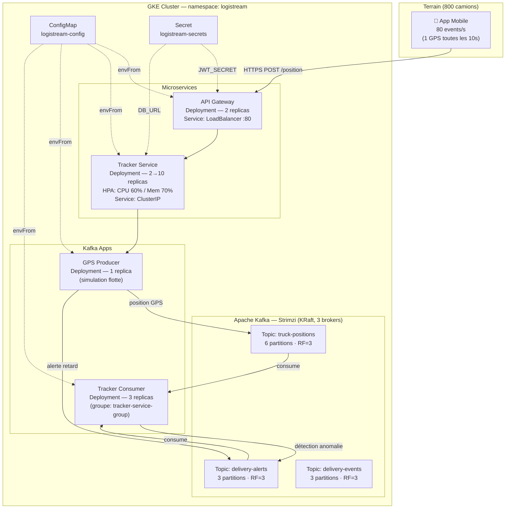

# LogiStream — Plateforme de suivi GPS en temps réel

Architecture microservices sur **Google Kubernetes Engine (GKE)** avec **Apache Kafka** (Strimzi) pour le streaming de positions GPS de flotte de camions.

---

## Architecture



---

## Structure du projet

```
tp3-logistream/
├── k8s/
│   ├── namespace.yaml        # Namespace "logistream"
│   ├── configmap.yaml        # Variables d'environnement partagées
│   ├── secret.yaml           # Secrets (DB_URL, JWT_SECRET, MAPS_API_KEY)
│   ├── api-gateway.yaml      # Deployment + LoadBalancer Service
│   ├── tracker-service.yaml  # Deployment + ClusterIP Service
│   ├── hpa.yaml              # HorizontalPodAutoscaler (tracker-service)
│   └── kafka-apps.yaml       # Deployments producer + consumer Kafka
├── kafka/
│   ├── cluster.yaml          # KafkaNodePool + Kafka (KRaft, 3 nœuds)
│   └── topics.yaml           # Topics : truck-positions, delivery-alerts, delivery-events
├── producer/
│   ├── gps-producer.js       # Simule les positions GPS de 3 camions (KafkaJS)
│   ├── gps-producer.test.js  # 8 tests unitaires
│   ├── package.json
│   └── Dockerfile
└── consumer/
    ├── tracker-consumer.js   # Consomme les topics + détecte anomalies (KafkaJS)
    ├── tracker-consumer.test.js  # 9 tests unitaires
    ├── package.json
    └── Dockerfile
```

---

## Déploiement sur GKE

### Prérequis

```bash
# Authentification GCP
gcloud auth login
gcloud config set project <PROJECT_ID>

# Connexion au cluster
gcloud container clusters get-credentials <GKE_CLUSTER> \
  --region=<GKE_REGION> --project=<PROJECT_ID>

# Installer l'opérateur Strimzi
kubectl create namespace logistream
kubectl apply -f 'https://strimzi.io/install/latest?namespace=logistream' \
  -n logistream
```

### Ordre de déploiement

```bash
# 1. Namespace
kubectl apply -f k8s/namespace.yaml

# 2. ConfigMap + Secret
kubectl apply -f k8s/configmap.yaml
kubectl apply -f k8s/secret.yaml

# 3. Cluster Kafka (attendre ~3-5 min)
kubectl apply -f kafka/cluster.yaml
kubectl wait kafka/logistream-kafka \
  --for=condition=Ready --timeout=5m -n logistream

# 4. Topics Kafka
kubectl apply -f kafka/topics.yaml

# 5. Microservices LogiStream
kubectl apply -f k8s/api-gateway.yaml
kubectl apply -f k8s/tracker-service.yaml
kubectl apply -f k8s/hpa.yaml
kubectl apply -f k8s/kafka-apps.yaml
```

### Vérification

```bash
# État des pods
kubectl get pods -n logistream

# Topics créés
kubectl get kafkatopics -n logistream

# HPA actif
kubectl get hpa -n logistream

# IP publique de l'API Gateway
kubectl get svc api-gateway-svc -n logistream

# Logs du producer (positions GPS en direct)
kubectl logs -f deployment/gps-producer -n logistream

# Logs du consumer (traitement + alertes)
kubectl logs -f deployment/tracker-consumer -n logistream
```

---

## CI/CD — GitHub Actions

Le pipeline [`.github/workflows/logistream-deploy.yml`](../.github/workflows/logistream-deploy.yml) se déclenche à chaque push sur `main` (chemins `tp3-logistream/**`).

| Job | Étapes |
|-----|--------|
| **1. test** | `npm install` + `npm test` producer & consumer + validation manifests K8s |
| **2. build-push** | Build Docker producer & consumer + push vers Artifact Registry (tag = SHA commit) |
| **3. deploy** | `kubectl set image` + `rollout status` sur GKE |

### Secrets GitHub requis

| Secret | Description |
|--------|-------------|
| `GCP_PROJECT_ID` | ID du projet GCP |
| `GCP_SA_KEY` | JSON du compte de service (rôles : Artifact Registry Writer, GKE Developer) |
| `GKE_CLUSTER` | Nom du cluster GKE |
| `GKE_REGION` | Région du cluster (ex : `europe-west9`) |

---

## Dimensionnement — charge LogiStream

| Composant | Replicas | CPU req | Mém req | Scaling |
|-----------|----------|---------|---------|---------|
| API Gateway | 2 | 100m | 128Mi | Manuel |
| Tracker Service | 2 → 10 | 200m | 256Mi | HPA 60% CPU |
| GPS Producer | 1 | 100m | 128Mi | Manuel |
| Tracker Consumer | 3 | 200m | 256Mi | Manuel |
| Kafka broker (×3) | 3 | 500m | 1Gi | Manuel |

Capacité cible : **80 events/s** (800 camions × 1 event/10s) absorbés par le topic `truck-positions` (6 partitions, RF=3).
